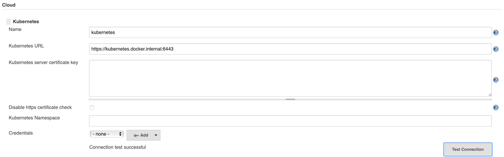
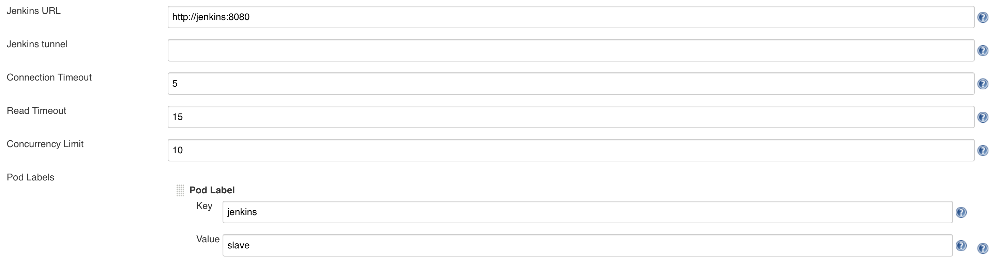
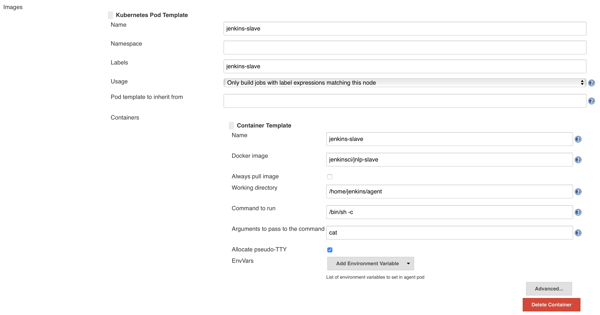
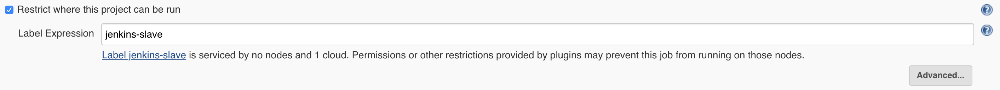
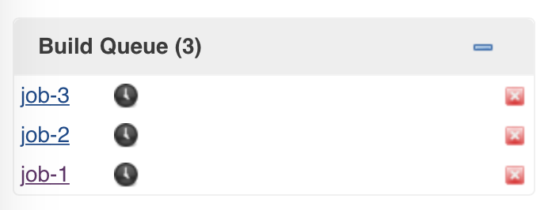
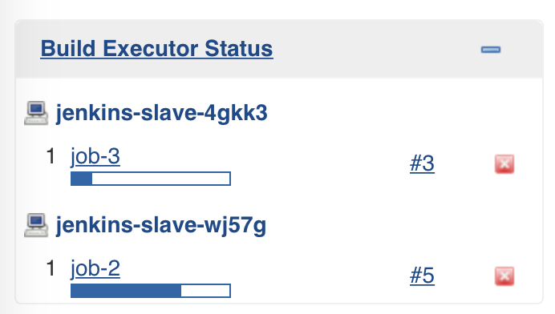

# On-demand Jenkins agents as Kubernetes Pods

* Running Jenkins master and agents as Kubernetes Pods.
* Agents are created on-demand as needed and deleted after use.
* Tested with Docker Desktop CE on MacOSX version 2.1.0.0.

## Creating a Docker image for the Jenkins master

> Configuration can be found in the [`master-docker-image`](./master-docker-image) directory.

### Writing the Dockerfile

* Create a new Dockerfile. The recommended base image is `jenkins/jenkins:lts`.
* Install all needed plugins with the script `install-plugins.sh`. It's a good idea to externalize the list of plugins into a text file. As a minimum, you'll need the `ssl-slaves` and `kubernetes` plugin. The plugin ID can be looked up by searching for the plugin name in the [plugins index](https://plugins.jenkins.io/).
* Run the container with the `jenkins` user.

### Building and pushing the image

* Build a new Docker image. Optionally, push the image to a registry.

```bash
$ docker build -t bmuschko/jenkins-kubernetes:0.0.1 .
$ docker push bmuschko/jenkins-kubernetes:0.0.1
```

## Running the Jenkins master on Kubernetes

> Configuration can be found in the [`kubernetes-objects`](./kubernetes-objects) directory.

### Creating the Deployment

* Create a new Deployment YAML file that uses the Docker image built in the previous step.
* Define only one replica for the Jenkins master.
* Skip the wizard installation step by defining the environment variable `JAVA_OPTS` with the value `-Djenkins.install.runSetupWizard=false`.
* Expose the container ports 8080 (HTTP) and 50000 (JNLP).
* Mount a volume for the Jenkins master with the directory `/var/jenkins_home`.

```bash
$ kubectl apply -f jenkins-deployment.yaml
```

### Creating the Service

* Create a new Service YAML file that selects the label of the Deployment.
* Expose the ports 8080 and 50000 with type `NodePort`.

```bash
$ kubectl apply -f jenkins-service.yaml
```

## Configuring the Kubernetes plugin

* Open _Manage Jenkins > Configure System_.
* Under the option _Cloud_ add a new Kubernetes cloud.

### Configuring the Kubernetes master

* Determine the Kubernetes master URL.

```bash
kubectl cluster-info | grep master
Kubernetes master is running at https://kubernetes.docker.internal:6443
```

* Enter the value under _Kubernetes URL_.



### Configuring the Jenkins URL

* In the field _Jenkins URL_ enter `http://jenkins:8080`.
* The domain name is the name of the Kubernetes Service. The port is the HTTP port exposed by the Service.



### Configuring the Jenkins agent as Pod

* Specify the Pod name `jenkins-slave`.
* Specify the Pod label `jenkins-slave`. Only those jobs that define the label will be able to run on a Kubernetes Pod.
* Specify the container name `jenkins-slave`. Without it the creation of the Pod will fail.
* As Docker image use `jenkinsci/jnlp-slave`. It's the compatible image recommended and tested by the Jenkins Kubernetes plugin.
* Use all other default container values.



### Configuring Jenkins jobs

* Create three different freestyle jobs named `job-1`, `job-2` and `job-3`.
* Each job define a single build step, a shell script with the command `sleep 30`.
* Restrict the jobs to only run on agents matching the label `jenkins-slave`.



### Running Jenkins jobs

* Trigger a manual build for all three agents.
* Initially they will be queued.



* The Kubernetes plugin will provision Pods for running the jobs.
* Jobs will be run in parallel on different Pods if needed.

